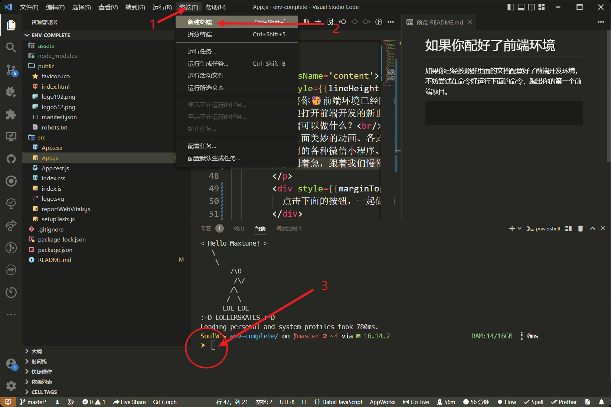
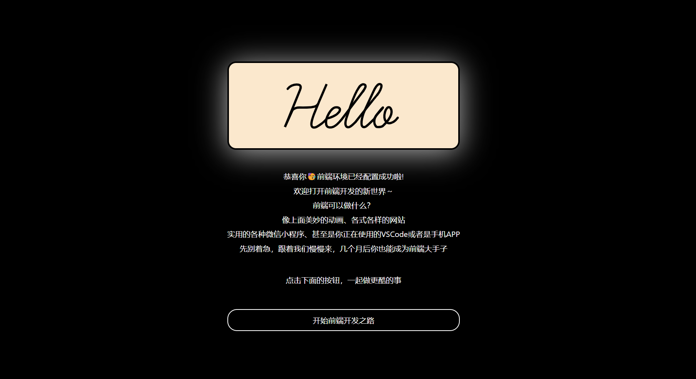

# 如果你配好了前端环境

如果你已经按照群里面的文档配置好了前端开发环境，不妨尝试在命令好运行下面的命令，跑出你的第一个前端项目。



首先点击vscode中的终端，然后新建终端

在下面的命令行输入以下指令

```shell
npm config set registry https://registry.npmmirror.com/
npm install
npm start
```

如果程序跑起来了，你应该可以在弹出的浏览器中看到这样的页面



那么恭喜你，环境配置已经没问题，而且你跑通了你的第一个前端程序啦～

点击下面的按钮，去探索一下我们推荐的前端学习路线吧⭐️️